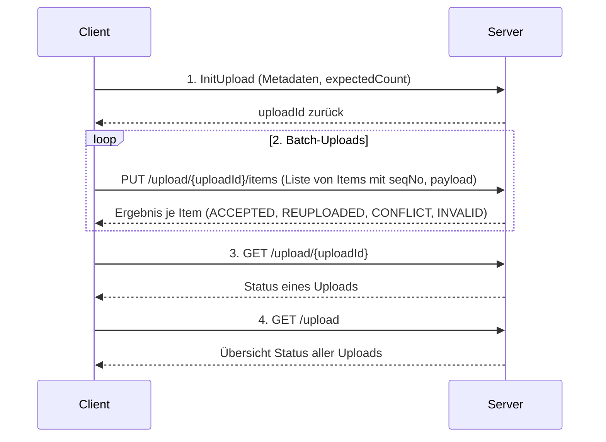

# REST Phase-Based Upload PoC (mit Inbox Pattern)

Dieses Proof of Concept zeigt, wie große Payloads zuverlässig und idempotent über eine REST-Schnittstelle hochgeladen werden können.  
Das System basiert auf dem **Inbox Pattern**: eingehende Payloads werden in einer Session gesammelt, gespeichert und asynchron verarbeitet.

---

## Endpunkte

### 1. InitUpload
```http
POST /zahlungsdaten-api/v1/upload
Content-Type: application/json
```
### Request-Body
```json
{
  "bewNr": "123456789",
  "vslNummer": "vsl0001",
  "anzahlDatensaetzeInsgesamt": 3
}
```
### Response-Body
```json
{
  "uploadId": "c117a36a-9664-41d7-a9b4-f38830022b73",
  "status": "ACTIVE",
  "expected": 3,
  "received": 0
}
```
Erstellt eine neue Upload-Session mit uploadId. Diese dient als Referenz für alle weiteren Requests.
Die Session bleibt für einen konfigurierbaren Zeitraum gültig (z. B. 2 Stunden).


### 2. BatchUpload
```http
PUT /zahlungsdaten-api/v1/upload/{uploadId}/items
Content-Type: application/json
```
### Request-Body
```json
[
  { "seqNo": 1, "payload": "{\"betrag\":100}" },
  { "seqNo": 2, "payload": "{\"betrag\":200}" },
  { "seqNo": 3, "payload": "{\"betrag\":300}" }
]
```
### Response-Body (erfolgreiche Verarbeitung)
```json
{
  "uploadId": "c117a36a-9664-41d7-a9b4-f38830022b73",
  "results": [
    { "seqNo": 1, "status": "ACCEPTED" },
    { "seqNo": 2, "status": "ACCEPTED" },
    { "seqNo": 3, "status": "ACCEPTED" }
  ]
}
```
### Response-Body (mit Verarbeitungsfehlern)
```json
{
  "uploadId": "c117a36a-9664-41d7-a9b4-f38830022b73",
  "results": [
    { "seqNo": 1, "status": "ACCEPTED" },
    {
      "seqNo": 2,
      "status": "INVALID",
      "error": {
        "code": "DUPLICATE_SEQ_NO",
        "message": "duplicate seqNo in request",
        "details": { "seqNo": 2 },
        "timestamp": "2025-09-10T14:30:45.123456"
      }
    },
    { "seqNo": 3, "status": "ACCEPTED" }
  ]
}
```

→ Jeder Eintrag wird idempotent anhand (uploadId, seqNo) verarbeitet.
Mögliche Statuswerte:

* ACCEPTED → erfolgreich akzeptiert und in Inbox persistiert
* REUPLOADED → zuvor fehlerhaft, jetzt erfolgreich akzeptiert/persistiert
* CONFLICT → bereits vorhanden (PENDING/PROCESSING/DONE)
* INVALID → ungültig (z. B. Duplikat: doppelte seqNo im Request)

### Error-Codes und Error-Struktur
```json
{
  "code": "ERROR_CODE",
  "message": "Human-readable Fehlermeldung",
  "details": { "contextSpecificInfo": "value" },
  "timestamp": "2025-09-10T14:30:45.123456"
}
```
Codes:

* DUPLICATE_SEQ_NO - Doppelte Sequenznummer im Request
* INVALID_SEQ_NO - Sequenznummer außerhalb des erlaubten Bereichs (1..expectedCount)
* UPLOAD_SESSION_NOT_OPEN - Upload-Session ist nicht im ACTIVE Status
* SEALED_NEW_ITEMS_NOT_ALLOWED - Neue Items nicht erlaubt bei SEALED Session
* SEALED_ONLY_ERROR_ITEMS_ALLOWED - In SEALED Session nur Re-Upload von ERROR Items erlaubt
* ITEM_NOT_FINISHED - Item ist noch in Bearbeitung (PENDING/PROCESSING)
* ITEM_ALREADY_PROCESSED - Item wurde bereits erfolgreich verarbeitet (DONE)

### 3. Status
```http
GET /zahlungsdaten-api/v1/upload/{uploadId}
```
### Response-Body
```json
{
  "uploadId": "c117a36a-9664-41d7-a9b4-f38830022b73",
  "uploadStatus": "SEALED",
  "expected": 3,
  "received": 3,
  "pending": 0,
  "processing": 0,
  "done": 3,
  "error": 0,
  "missingSequence": [],
  "errorSequence": []
}
```
Liefert den aktuellen Status der Upload-Session, inkl. Fortschritt, fehlender Sequenzen und fehlerhafter Items.

### 4. Status aller Uploads
```http
GET /zahlungsdaten-api/v1/upload
```
### Response-Body
```json
{
  "total": 2,
  "items": [
    {
      "uploadId": "11111111-1111-1111-1111-111111111111",
      "uploadStatus": "ACTIVE",
      "expected": 3,
      "received": 2,
      "pending": 2,
      "processing": 0,
      "done": 0,
      "error": 0,
      "missingSequence": [3],
      "errorSequence": []
    },
    {
      "uploadId": "22222222-2222-2222-2222-222222222222",
      "uploadStatus": "SEALED",
      "expected": 5,
      "received": 5,
      "pending": 0,
      "processing": 0,
      "done": 5,
      "error": 0,
      "missingSequence": [],
      "errorSequence": []
    }
  ]
}
```
Zeigt eine Übersicht aller aktiven Uploads mit Fortschritt und Fehlern.

### Merkmale

* Idempotenz: (uploadId, seqNo) verhindert Duplikate.
* Fehlerbehandlung: Nur fehlerhafte Items müssen neu gesendet werden (Re-Upload).
* Inbox Pattern: Eingehende Daten werden gesammelt, dann asynchron verarbeitet.

### Sequenzdiagramm



## Build Commands

### Standard Maven Commands
```bash
# Build the project
mvn compile

# Run tests  
mvn test

# Package the application
mvn package

# Run the application
mvn spring-boot:run
```

### Testing
```bash
# Run all tests
mvn test

# Run specific test class
mvn test -Dtest=UploadApiIntegrationTest
```
